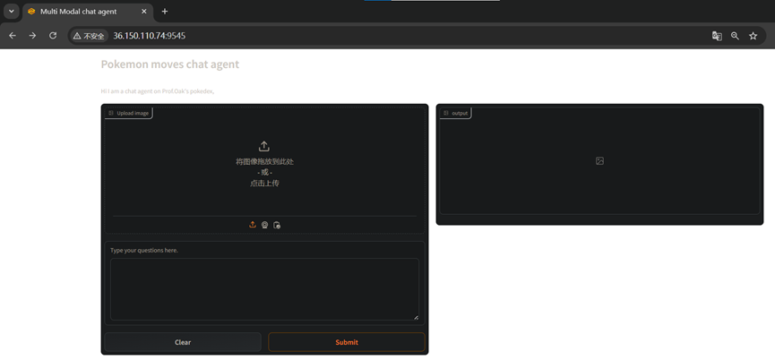
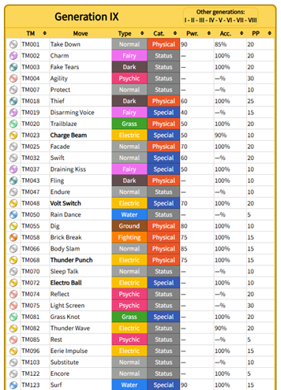
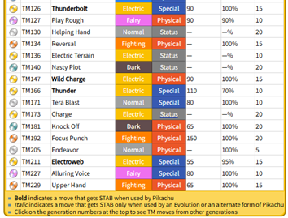
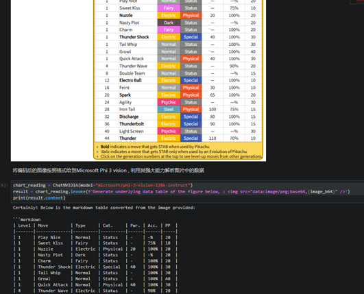
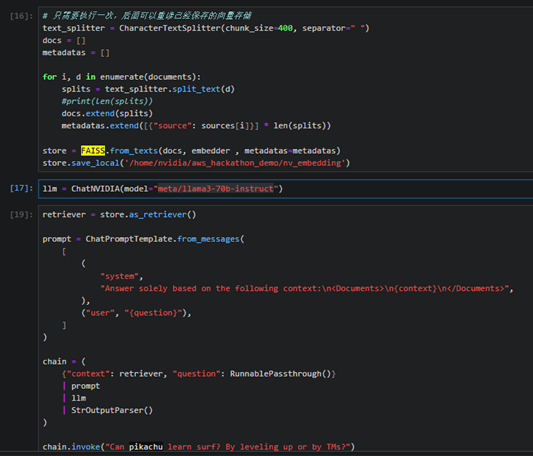
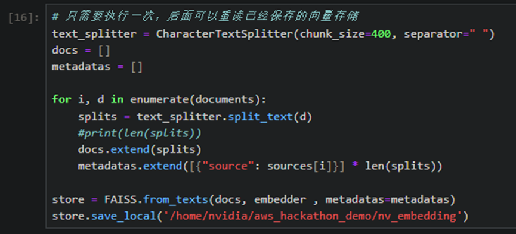

# PokeCoach

## 项目说明

一个用来分析宝可梦配招的Agent，读入特定宝可梦的卡片信息，分析宝可梦的配招合理性。

本项目是一个基于人工智能的宝可梦配招分析agent。它能够读取特定宝可梦的卡片信息,包括种族值、属性、特性等基础数据,然后根据这些信息以及当前游戏版本的元数据,为训练家提供深入的配招建议和分析。

### 亮点

调用VLM来读取特定宝可梦的资料，整理OCR结果形成表格。

### 特点

首先分析特定宝可梦的配招合法性，然后评估当前配招的优缺点，根据宝可梦种族值，六维，特性，性格等基础属性，推荐最优配招组合。

### 功能

以分析皮卡丘的配招为例简单介绍本agent的功能。
1.将皮卡丘的六维截图传给agent、在文本框里输入皮卡丘的等级，努力值分配，性格，特性。调用视觉大模型读取六维截图，读取其他基础信息。
2.按要求分批输入皮卡丘可通过升级习得的技能、可通过技能机器（TM）习得的技能。既可以在文本框内输入（最好是在其它工具里将表格导出成csv或者markdown的表格形式），也可以在图片输入框里直接传入宝可梦百科的卡片截图。大模型将皮卡丘可学习的技能整理为表格存入自身知识库。

3.大模型以本身存储的知识，配合皮卡丘可学习的技能，对用户后续输入的问题做出解答。比如用户此时询问“请问皮卡丘能否学习冲浪术？”。
4.大模型根据自身知识，通常电系宝可梦不能学习水系技能，应该明确回答皮卡丘不能学习冲浪术。但根据知识库里的提示，皮卡丘可以通过技能机器学习冲浪术，此处实际的回答为“是的，皮卡丘可通过TM来学习冲浪术，这对于电系宝可梦是一个不常规的技能，但是根据我的资料显示皮卡丘确实可以学习冲浪术以克制岩石系和地面系宝可梦，补全自己的打击面。”

初衷：在大学好不容易遇到一群喜欢玩宝可梦的人，大家研究配队打PVP玩的很开心，但是一旦联网打有排名的比赛，我们总是特别菜。大家都想着做一个工具来帮助自己赢下更多的比赛提升排名。

## NIM 使用

利用NIM里的microsoft/phi-3-vision-128k-instruct模型来读取图片中内容。

利用NIM里的meta/llama3-70b-instruct模型来做RAG。

为了节约API credits，使用deepseek官网网页版，API来处理原始数据资料。
利用B站上接入大模型能力（GPT-4o、DeepSeek-v3等）总结视频的机器人来总结宝可梦对战攻略视频里配队的精华。

## 技术创新点

使用NIM的API配合langchain框架和FAISS向量数据库在Jetson平台上部署RAG应用。

使用BeautifulSoup来从bulbapedia上收集宝可梦数据，pandas处理收集后的数据并导出csv。
使用RPA工具从bulbapedia上收集宝可梦数据。
针对模型对问题回答不够精准的特点，使用 豆包 来帮忙批量将预处理后的文档转换为问答格式。

## UI 界面优化

对于现在的Gradio不是特别熟悉，改图标不是很擅长，改配色比较快捷，而且更直观。我们换个思路，在VSCode里找到一个看起来还不错的暗黑主题模式，然后截图，在PS里用取色器把颜色取出来，直接修改配色。
